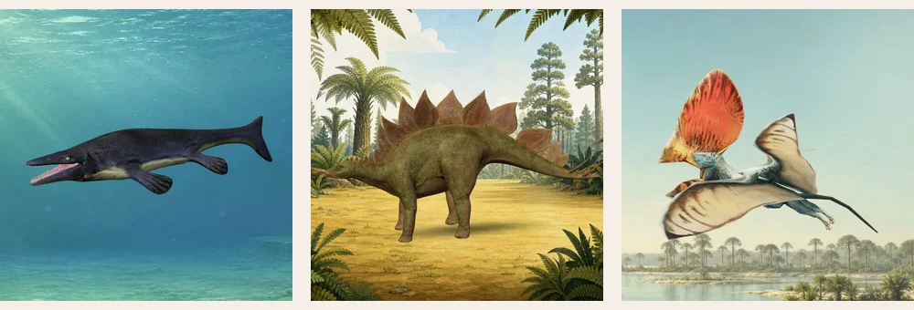

  

<h1 align="center">Hi, I’m Leon.</h1>

  <strong>Frontend developer &amp; dad building calm, useful products from real needs.</strong> 
  一个程序员爸爸，从身边的真实需要出发，用 AI 做点真的东西。

  <strong><a href="https://leon-made-this.work/museum/">打开博物馆 · Open the museum</a></strong>
  ·
  <a href="https://github.com/s010s/prehistoric-animal-museum">查看源码 · View source</a>
  ·
  <a href="https://github.com/s010s/prehistoric-animal-museum/blob/main/README.zh-CN.md">中文介绍</a>

## 正在做 · Currently building

### [史前动物博物馆 · Prehistoric Animal Museum](https://github.com/s010s/prehistoric-animal-museum)

女儿不喜欢以追逐和打斗为中心的恐龙内容，所以我做了一个可以安静观察的地方。孩子可以选择动物、转动模型、听一段简短介绍；大人可以坐在旁边，一起看，也可以顺着家长资料继续聊下去。

My daughter was uneasy with dinosaur stories built around chases and fights, so I made a quieter place to look closely. Children can choose an animal, turn the model, and listen to a short introduction while a grown-up explores beside them.

  

<a href="./assets/readme/SOURCES.md">Preview image credits</a>

`18 animals` · `English / 简体中文` · `Mandarin + English narration` · `No account` · `No ads` · `No analytics scripts`

Built with React, TypeScript, Three.js, Vite, Vitest, and Playwright. The museum is free to visit, open source, responsive across phones and desktops, keyboard accessible, and respectful of reduced-motion preferences.

## 小工具 · Small tools

### [Bob for OpenClip](https://github.com/s010s/openclip-bob)

从 PopClip 转到 OpenClip 后，我想保留一直在用的 Bob 划词翻译流程，于是做了这个小插件。选中文字，点一下按钮，就能在 Bob 中查看翻译，继续使用原有的翻译服务配置。

After moving from PopClip to OpenClip, I built a small extension to keep my familiar Bob translation workflow. Select text, click **Translate with Bob**, and read the result in Bob using your existing translation services.

[下载插件 · Download](https://github.com/s010s/openclip-bob/releases/latest) · [源码与使用说明 · Source & guide](https://github.com/s010s/openclip-bob)

`macOS` · `AppleScript` · `MIT`

## 我怎样做 · How I build

> **真实需要 → 人的判断 → AI 辅助实现 → 可用作品 → 真实反馈** 
> Real need → human judgment → AI-assisted making → something people can use → feedback.

AI expands what I can make. It does not replace the need, the product judgment, fact-checking, or final review.

## 近期合并的开源修复 · Recent merged contributions

- [**cmux #1496**](https://github.com/manaflow-ai/cmux/pull/1496) — fixed an `EXC_BAD_ACCESS` crash on Intel Macs caused by over-releasing a Ghostty font. 
  修复 Ghostty 字体被过度释放导致的 Intel Mac 崩溃。

- [**Kaku #213**](https://github.com/tw93/Kaku/pull/213) — stopped the AI Assistant from treating an expected SIGPIPE exit code `141` as a command failure. 
  避免把退出分页器等正常操作误报成命令失败。

- [**Kaku #318**](https://github.com/tw93/Kaku/pull/318) — cleared stale tab-drag state so selecting terminal text no longer reorders a previous tab. 
  清除残留的标签页拖拽状态，修复终端文本选择时的错误重排。

- [**KISS Translator #574**](https://github.com/fishjar/kiss-translator/pull/574) — added an opt-in setting to bypass translation services for single-word selections, reducing unnecessary latency and token use when enabled. 
  新增可选设置，启用后单词查询可以跳过翻译服务，减少等待和不必要的 Token 消耗。

## 早些时候 · Earlier work

[**vue-text-selection**](https://github.com/s010s/vue-text-selection) is a small Vue 2 directive for browser text selections—an early attempt to make an awkward browser interaction simpler.

这是我在 Vue 2 时期做的文本选择小工具，也是一次把复杂浏览器交互做得更简单的早期尝试。
